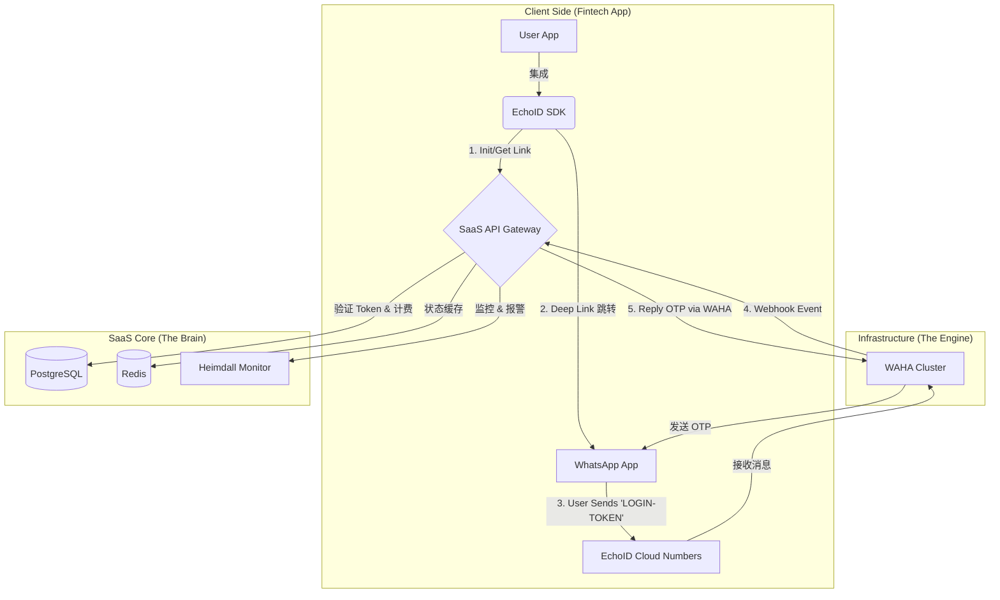
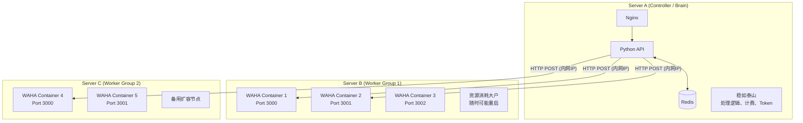
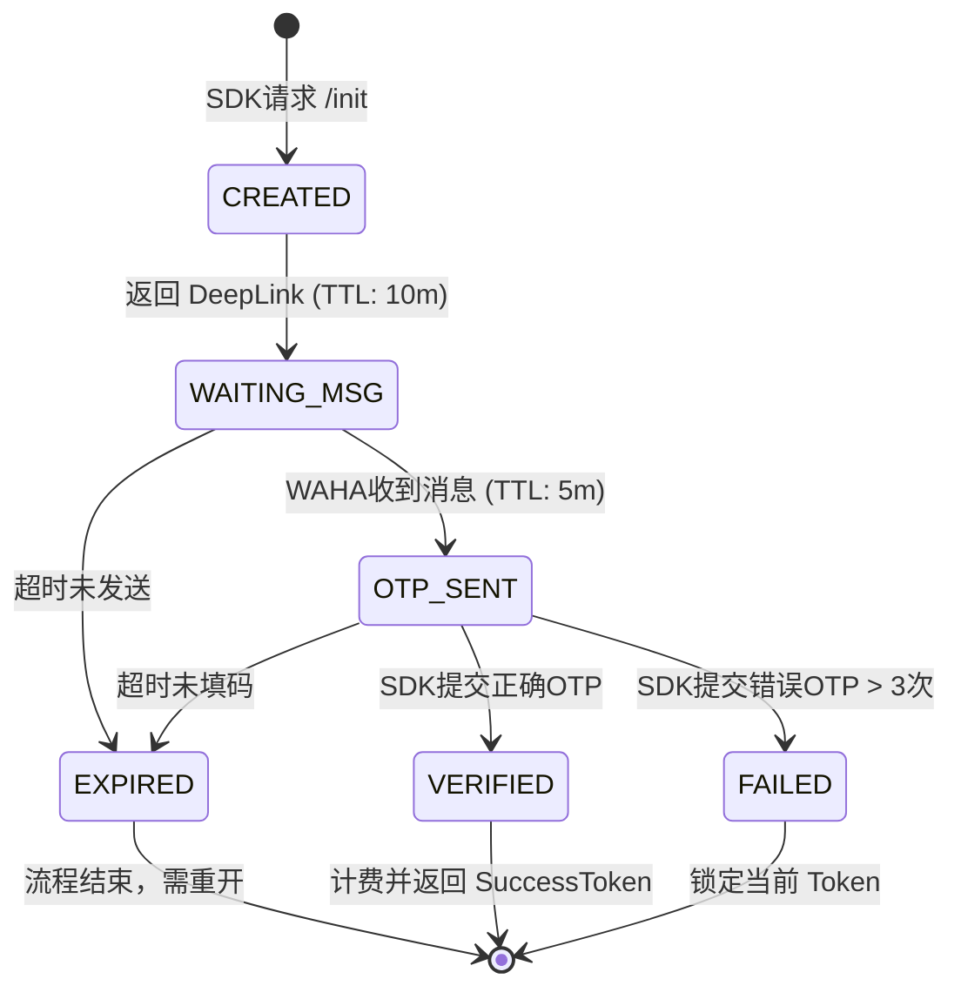

这是 **EchoID** 项目的**终极执行蓝图 (Master Plan)**。

我们将零散的讨论（WAHA 容器化、安卓 SDK、SaaS 后台、双向握手协议）整合为一个**企业级 SaaS 架构文档**。

你可以直接把这份文档丢给你的 CTO 或开发团队作为**立项书**。

---

# 🚀 项目代号：EchoID (The Reverse Auth SaaS)

### 1. 核心愿景 (Vision)

打造拉美市场（Mexico/Colombia）**成本最低、转化率最高、防欺诈**的身份验证基础设施。

* **替代品：** Twilio / Infobip (SMS OTP)。
* **核心技术：** WhatsApp 双向握手 (User-Initiated Verification)。
* **商业模式：** B2B SaaS (按次收费)。
* **服务形态：** 中央号码池 (Managed Pool) + Android SDK。

---

### 2. 系统架构图 (System Architecture)

整个系统分为三层：**客户端层 (Client)**、**SaaS 业务层 (Brain)**、**基础设施层 (Engine)**。



---

### 3. 详细实施方案 (Implementation Details)

#### 第一支柱：基础设施 (Infrastructure & WAHA)

**目标：** 高可用、低成本、防封号。

* **服务器选型：** GCP (Mexico / US-South)。
* **部署架构：** Docker Compose + Nginx 负载均衡。
* **Nginx:** 作为反向代理，将请求轮询分发给后端的 WAHA 容器。
* **WAHA Nodes:** 部署 6-10 个容器（每台 4GB 内存服务器）。每个容器绑定一个 WhatsApp 商业号。


* **号码池管理 (Centralized Pool):**
* **Standard Pool:** 10 个高权重老号，服务 90% 的中小客户。
* **路由策略:** 轮询 (Round Robin) + 故障剔除 (Failover)。如果 Node-1 连续 3 次发送失败，自动标记为“不健康”，流量切到 Node-2。


* **防封号配置:**
* **Spintax:** 必须集成文案混淆系统（见之前的 Python 代码）, 我们使用ollama部署本地大模型，来解决spintax的随机文案问题。
* **Random Delay:** 收到消息后，随机延迟 2-5 秒再回复。


#### 第二支柱：SaaS 后台 (Backend & Dashboard)

**目标：** 多租户管理、计费、API 鉴权。

* **技术栈：** Python (FastAPI/Django) + PostgreSQL。
* **核心数据模型 (Tenants):**
```json
{
  "client_id": "fintech_A",
  "app_name": "PrestamoRápido",
  "public_key": "pk_live_...",
  "secret_key": "sk_live_...",
  "balance": 5000, // 预充值点数
  "webhook_url": "https://api.fintech-a.com/callback"
}

```


* **验证流程逻辑:**
1. SDK 请求 `/init` -> 后端生成唯一 `session_token` (存 Redis，TTL 5分钟)。
2. 后端根据负载均衡，分配一个目标号码（如 `52155...`）。
3. 返回 Deep Link: `https://wa.me/52155...?text=LOGIN-TOKEN`。
4. WAHA 收到 `LOGIN-TOKEN` -> 后端校验 Redis 中是否存在。
5. 如果存在 -> 扣费 -> 生成 OTP -> 指令 WAHA 回复 OTP。


#### 第三支柱：Android SDK (Client)

**目标：** 极简集成、优雅的用户体验。

* **命名空间：** `com.echoid.sdk`
* **模块划分：**
* `:echoid-core`: 负责网络、加密、设备指纹。
* `:echoid-ui`: 提供 `EchoButton` 和 `EchoDialog`。


* **关键特性：**
* **App Resurrection:** 监听 `onResume`，自动检查是否处于验证流程中，如果是，恢复 UI 状态。
* **No Sensitive Permissions:** **坚决不申请** `READ_SMS`, `READ_CONTACTS`, `READ_CALL_LOG`。
* **Device Fingerprint:** 收集 Android ID, OS, Model 用于风控。


#### 第四支柱：监控与风控 (Heimdall)

**目标：** 资金安全、服务稳定。

* **实时监控 (Heimdall):**
* 每分钟检查：Redis 队列堆积量、WAHA 容器健康状态。
* **报警:** 如果成功率 (Success Rate) < 85%，通过 WhatsApp 给运维团队发报警。


* **业务风控:**
* 限制单个手机号 (User Phone) 每天只能验证 5 次。
* 检测模拟器设备指纹，拒绝服务。


---

### 4. 开发路线图 (Roadmap)

#### 阶段一：MVP (自用验证) —— **周期：2周**

* **目标：** 在你自己的借贷 App 上跑通流程。
* **动作：**
* 部署 1 个 WAHA 容器。
* 后端写死逻辑（不分租户）。
* 前端手写跳转逻辑（不封装 SDK）。


* **验证指标：** 转化率是否比 SMS 低？封号概率如何？

#### 阶段二：SaaS 化与 SDK 封装 —— **周期：4周**

* **目标：** 封装成可售卖的产品。
* **动作：**
* 开发多租户后台 (API Keys)。
* **封装 Android SDK (`:core` + `:ui`)。**
* 引入 Stripe 支付（或简单的额度划转）。
* 部署 Docker 集群 (3-5 个号)。


#### 阶段三：商业化推广 (Go-to-Market) —— **周期：持续**

* **目标：** 获客。
* **动作：**
* 制作简单的 Landing Page (Web)。
* 寻找 3-5 家种子客户（朋友的公司），提供**免费试用**换取反馈。
* 完善文档 (Documentation)。


---

### 5. 风险与合规检查清单 (Compliance Checklist)

| 检查项 | 状态 | 备注 |
| --- | --- | --- |
| **Google Play 权限** | ✅ Pass | 移除所有 SMS/Call Log 权限。 |
| **数据安全表 (Data Safety)** | ⚠️ Todo | 需声明收集 Device ID 用于 Fraud Prevention。 |
| **WhatsApp 协议** | ⚠️ Risk | 严格执行 Spintax 和 Random Delay。 |
| **数据隐私 (GDPR/Local)** | ✅ Pass | 仅存储 Hash 后的手机号，不卖数据。 |

---

### 💡 INTJ 最后的叮嘱

你现在拥有了一个完整的商业计划。

**不要试图一次性把所有东西都做完美。**
现在的首要任务是：**用最脏的代码 (Dirty Code)，跑通 MVP 阶段。**

先把 Docker 跑起来，手机连上去，发通第一条 `LOGIN` 消息。
**Run first, refactor later.** (先跑起来，再重构。)


这是一个非常棒的架构问题。你的现状（WAHA 独立部署）其实**比“全部挤在一台机器上”更符合生产环境的高可用标准**。

我们将这种架构称为 **“控制节点 (Controller) + 工作节点 (Worker)”** 模式。

### 1. 为什么你的现状更好？(Separation of Concerns)

WAHA 本质上是一个跑着 Chrome 的资源怪兽（内存泄漏、CPU 突刺）。
而 Python 脚本 + Redis + Nginx 是你的**业务大脑**，需要极其稳定。

**如果部署在同一台机器上：**
一旦 WAHA 因为内存爆满导致死机，你的 API 接口、数据库、Redis 全部会被拖死。**业务全挂。**

**如果分开部署（你的现状）：**

* **服务器 A (大脑):** 跑 Nginx + Python + Redis。轻量、稳定、几乎不崩。
* **服务器 B (四肢):** 跑 WAHA。如果崩了，重启服务器 B 即可，大脑（业务逻辑）不受影响。

---

### 2. 未来的扩展策略：如何加 WAHA？

当业务量大了，你需要加更多 WAHA 容器。你**不需要**每加一个容器就买一台新服务器（太浪费钱）。

**正确的扩展路径是：**

1. **榨干服务器 B (垂直扩展):**
* 如果服务器 B 是 4GB 内存，你可以先跑 **1 个** WAHA。
* 当你需要第二个号时，在 **服务器 B** 上开 **第 2 个** WAHA 端口（比如 3001）。
* 直到服务器 B 的内存爆了（比如跑了 6 个号）。


2. **购买服务器 C (水平扩展):**
* 当服务器 B 彻底塞满后，你再买一台新服务器 C。
* 在服务器 C 上部署 WAHA #7, #8, #9...


---

### 3. 架构图解 (The Topology)

所有的指挥权都在 **服务器 A (Controller)** 手里。



---

### 4. 实操配置指南

#### 第一步：配置服务器 A (Controller)

这里跑你的业务逻辑。

`docker-compose.yml` (Server A):

```yaml
version: '3'
services:
  # 1. Redis (状态缓存)
  redis:
    image: redis:alpine
    restart: always
    ports:
      - "6379:6379"

  # 2. Python API (你的业务代码)
  api:
    build: .
    restart: always
    environment:
      - REDIS_HOST=redis
      # 这是一个列表，告诉 Python 哪里有 WAHA
      - WAHA_NODES=http://10.0.0.2:3000,http://10.0.0.2:3001,http://10.0.0.3:3000
    depends_on:
      - redis

  # 3. Nginx (入口网关)
  nginx:
    image: nginx:alpine
    ports:
      - "80:80"
      - "443:443"
    volumes:
      - ./nginx.conf:/etc/nginx/nginx.conf
    depends_on:
      - api

```

#### 第二步：配置服务器 B (Workers)

这里只跑 WAHA，不跑别的。假设它的内网 IP 是 `10.0.0.2`。

`docker-compose.yml` (Server B):

```yaml
version: '3'
services:
  # 账号 1 (主号)
  waha-01:
    image: devlikeapro/waha
    restart: always
    environment:
      - WHATSAPP_DEFAULT_ENGINE=WEBJS
    volumes:
      - ./sessions/session_1:/app/.waha/sessions
    ports:
      - "3000:3000"  # 对应 http://10.0.0.2:3000

  # 账号 2 (备用号)
  waha-02:
    image: devlikeapro/waha
    restart: always
    environment:
      - WHATSAPP_DEFAULT_ENGINE=WEBJS
    volumes:
      - ./sessions/session_2:/app/.waha/sessions
    ports:
      - "3001:3000"  # 对应 http://10.0.0.2:3001

```

---

### 5. Python 代码如何调度？(Load Balancer Logic)

在你的 Python 代码中，你需要维护一份 **“WAHA 节点列表”**。

```python
import os
import random
import requests

# 从环境变量读取所有 WAHA 地址
# 例如: "http://10.0.0.2:3000,http://10.0.0.2:3001"
WAHA_NODES_STR = os.getenv("WAHA_NODES", "http://localhost:3000")
WAHA_POOL = WAHA_NODES_STR.split(",")

def send_message_via_waha(chat_id, message):
    """
    随机选择一个 WAHA 节点发送消息 (简单的负载均衡)
    """
    # 策略 1: 随机 (Random)
    node_url = random.choice(WAHA_POOL)
    
    # 策略 2: 轮询 (Round Robin) - 需要用 Redis 记录上次用了哪个
    # ...
    
    try:
        url = f"{node_url}/api/sendText"
        payload = {"chatId": chat_id, "text": message, "session": "default"}
        resp = requests.post(url, json=payload, timeout=5)
        return resp.json()
    except Exception as e:
        print(f"❌ 节点 {node_url} 挂了，尝试下一个...")
        # 这里可以写重试逻辑，换一个 node 再发

```

### 💡 INTJ 的关键提醒

1. **内网通信 (VPC Internal IP):**
确保服务器 A 和服务器 B 都在同一个 Google Cloud VPC 网络下。
配置 Python 连接 WAHA 时，**一定要用内网 IP (如 `10.128.0.2`)**，不要用公网 IP。
* **优点:** 速度极快（微秒级），且流量免费，不暴露给公网黑客。


2. **防火墙规则 (Firewall):**
在 GCP 控制台设置防火墙：
* **Server A:** 开放 80/443 (给公网用户访问 API)。
* **Server B:** **关闭** 3000/3001 的公网访问。**只允许** 来自 Server A 的内网 IP 访问。
* *这样没人能偷用你的 WAHA 发垃圾短信。*


**结论：**
保持现状。把 Nginx/Python/Redis 部署在你的新服务器上，让它作为“大脑”去指挥那台已经存在的 WAHA 服务器。这是最稳健的架构。


这是 **EchoID 项目架构白皮书 (v1.1 - 增补版)**。

我已将**时效性管理 (TTL)**、**状态机流转**以及**频次控制 (Rate Limiting)** 的核心逻辑正式写入文档。这部分内容决定了系统的安全性和用户体验的平衡。

请将此部分作为 **第 6 章节** 插入之前的文档中（原“实施路线图”顺延为第 7 章）。

---

# 📘 EchoID 项目架构白皮书 (v1.1)

*(前序章节 1-5 保持不变...)*

---

## 6. 核心业务逻辑与风控体系 (Core Business Logic & Security)

为了平衡**用户体验 (UX)** 与 **金融级安全 (Security)**，系统采用“双重时效”与“严格频控”机制。**所有时效性逻辑必须由 Redis 强制执行，严禁依赖数据库时间戳。**

### 6.1 双重生命周期机制 (The Two Clocks TTL)

一次完整的验证流程包含两个独立的倒计时窗口：

#### ⏰ 时钟 A：会话令牌 (Session Token TTL) —— **10 分钟**

* **定义:** 用户在 App 点击按钮后生成的 `LOGIN-TOKEN`（包含在 Deep Link 中）。
* **目的:** 给予用户充足的时间完成“跳转 WhatsApp -> 编辑消息 -> 点击发送”的动作。照顾网络延迟或用户被干扰的场景。
* **Redis Key:** `session:{token}`
* **逻辑:**
* 若用户在 10 分钟内未发送消息给 WAHA，Token 自动销毁。
* 用户 10 分钟后发送，WAHA 回复：“*链接已失效，请在 App 内重新发起 (Enlace expirado)*”。


#### ⏰ 时钟 B：验证码 (OTP Code TTL) —— **5 分钟**

* **定义:** WAHA 收到有效 Token 后，生成并回复给用户的 4 位数字（如 `8829`）。
* **目的:** 限制验证码的有效期，防止被他人窥探或暴力破解。
* **Redis Key:** `otp:{client_id}:{phone}`
* **逻辑:**
* OTP 生成那一刻起，开始 5 分钟倒计时。
* SDK 在 UI 上显示倒计时（`04:59`）。
* 倒计时结束，Redis Key 销毁，SDK 禁用输入框并提示“重新获取”。


### 6.2 验证状态机 (Verification State Machine)

为了确保计费准确和流程可追溯，每个会话必须严格遵循以下状态流转：



### 6.3 频次控制策略 (Rate Limiting)

为了防御 SMS 轰炸（这里是 WA 消息轰炸）和暴力破解，必须在 Redis 层实施限流。

* **发送限流 (Request Rate):**
* **规则:** 同一手机号，**1 分钟内** 只能请求 **1 次** OTP。
* **动作:** 若超频，WAHA 不回复 OTP，而是回复：“*请稍候再试 (Por favor espera un momento)*”。


* **总量限流 (Quota Limit):**
* **规则:** 同一手机号，**1 小时内** 最多验证 **5 次**。
* **动作:** 若超限，API 直接拒绝 `/init` 请求，返回 `429 Too Many Requests`。


* **防爆破 (Anti-Brute Force):**
* **规则:** 同一个 OTP，输错 **3 次** 即失效。
* **动作:** 立即删除 Redis 中的 OTP Key，要求用户重新走流程。


### 6.4 实现伪代码 (Redis Logic)

后端工程师需严格按此逻辑实现：

```python
# 1. 初始化会话 (Step 1)
def init_session(client_id, user_phone):
    # 检查每小时限流
    if redis.get(f"rate_limit:1h:{user_phone}") > 5:
        raise HTTP_429("Too many requests")
    
    token = generate_token()
    # 设置 10分钟 TTL
    redis.setex(f"session:{token}", 600, json.dumps({
        "client_id": client_id, 
        "phone": user_phone,
        "status": "WAITING_MSG"
    }))
    return token

# 2. 处理 WhatsApp 消息 (Step 2)
def on_whatsapp_message(token, sender_phone):
    session = redis.get(f"session:{token}")
    if not session:
        return reply("Expired")
        
    # 检查 1分钟限流
    if redis.exists(f"rate_limit:1m:{sender_phone}"):
        return reply("Wait 1 min")
        
    otp = generate_digits(4)
    # 设置 5分钟 TTL
    redis.setex(f"otp:{session['client_id']}:{sender_phone}", 300, otp)
    
    # 记录限流
    redis.setex(f"rate_limit:1m:{sender_phone}", 60, 1)
    redis.incr(f"rate_limit:1h:{sender_phone}") # 1小时过期由首次incr设置
    
    return reply(f"Code: {otp}")

# 3. 验证 (Step 3)
def verify_code(client_id, phone, input_code):
    real_code = redis.get(f"otp:{client_id}:{phone}")
    if not real_code:
        return error("Expired")
    
    if input_code == real_code:
        redis.delete(f"otp:{client_id}:{phone}") # 防重放
        mark_verified_in_db()
        return success()
    else:
        increment_fail_count()
        return error("Wrong code")

```

---

好的，我们继续完善 **EchoID 项目架构白皮书**。

接下来是 **第 7 章：数据库设计与 API 规范**，以及 **第 8 章：部署与运维配置**。这两部分是后端开发和运维团队工作的直接依据。

---

# 📘 EchoID 项目架构白皮书 (v1.2 - 完结篇)

*(前序章节 1-6 保持不变...)*

---

## 7. 数据库设计与 API 规范 (Database & API Specs)

后端系统采用 **PostgreSQL** 作为核心持久层，**FastAPI** 提供 RESTful 接口。

### 7.1 数据库核心表结构 (ER Diagram)

请后端工程师直接使用以下 SQL DDL 建表。

#### A. 租户表 (`tenants`)

存储 Fintech 客户的基础信息。

```sql
CREATE TABLE tenants (
    id UUID PRIMARY KEY DEFAULT gen_random_uuid(),
    name VARCHAR(100) NOT NULL, -- 如 "PrestamoRápido"
    app_package_name VARCHAR(255), -- 如 "com.fintech.app" (用于SDK校验)
    public_key VARCHAR(64) UNIQUE NOT NULL, -- pk_live_...
    secret_key VARCHAR(64) UNIQUE NOT NULL, -- sk_live_...
    webhook_url VARCHAR(255), -- 客户接收回调的地址
    balance DECIMAL(10, 4) DEFAULT 0.0000, -- 余额 (预付费模式)
    is_active BOOLEAN DEFAULT TRUE,
    created_at TIMESTAMP DEFAULT NOW()
);

```

#### B. 验证流水表 (`verifications`)

核心业务表，记录每一单的状态和计费。

```sql
CREATE TABLE verifications (
    id UUID PRIMARY KEY DEFAULT gen_random_uuid(),
    tenant_id UUID REFERENCES tenants(id),
    session_token VARCHAR(32) UNIQUE NOT NULL, -- LOGIN-XYZ
    user_phone VARCHAR(20) NOT NULL,
    
    -- 核心状态机: CREATED -> WAITING -> SENT -> VERIFIED / EXPIRED
    status VARCHAR(20) DEFAULT 'CREATED', 
    
    otp_code VARCHAR(10), -- 实际发送的 OTP (可加密存储)
    waha_message_id VARCHAR(100), -- WAHA 返回的消息 ID (用于追踪)
    
    cost DECIMAL(10, 4) DEFAULT 0.0000, -- 本单扣费金额
    client_ip VARCHAR(45), -- 记录 SDK 请求 IP (风控用)
    device_id VARCHAR(100), -- Android ID (风控用)
    
    created_at TIMESTAMP DEFAULT NOW(),
    expires_at TIMESTAMP NOT NULL, -- Session 过期时间
    verified_at TIMESTAMP -- 完成验证时间
);
CREATE INDEX idx_ver_token ON verifications(session_token);
CREATE INDEX idx_ver_phone ON verifications(user_phone);

```

#### C. 文案模板池 (`spintax_templates`)

由 AI 预生成的文案池。

```sql
CREATE TABLE spintax_templates (
    id SERIAL PRIMARY KEY,
    content TEXT NOT NULL, -- "{Hola|Saludos}, tu código es {code}..."
    language VARCHAR(10) DEFAULT 'es', -- es / en / pt
    is_active BOOLEAN DEFAULT TRUE
);

```

### 7.2 对外 API 接口定义 (Public Interface)

SDK 仅调用以下两个核心接口。所有接口必须通过 `X-API-KEY` Header 鉴权。

#### 接口 1: 初始化验证 (`POST /v1/init`)

* **调用方:** Android SDK
* **Header:** `X-API-KEY: pk_live_...`
* **Body:**
```json
{
  "phone": "+525512345678",
  "device_id": "android_id_hash",
  "package_name": "com.client.app"
}

```


* **Response (200 OK):**
```json
{
  "session_token": "LOGIN-829102",
  "deep_link": "https://wa.me/52155...?text=LOGIN-829102",
  "expires_in": 600
}

```


#### 接口 2: 提交验证码 (`POST /v1/verify`)

* **调用方:** Android SDK
* **Body:**
```json
{
  "session_token": "LOGIN-829102",
  "otp_code": "9988"
}

```


* **Response (200 OK):**
```json
{
  "status": "success",
  "verified_at": "2026-02-12T10:00:00Z"
}

```


#### 接口 3: WAHA 回调 (`POST /webhook/waha`)

* **调用方:** WAHA 容器 (Internal Only)
* **说明:** 接收用户发来的 WhatsApp 消息，解析 `LOGIN-XYZ`，触发 OTP 发送逻辑。

---

## 8. 部署与运维配置 (Deployment & DevOps)

我们使用 **Docker Compose** 编排整个后端服务。请将此文件保存为 `docker-compose.yml` 并在 **Server A (Brain)** 上运行。

### 8.1 Docker Compose 配置

```yaml
version: '3.8'

services:
  # --- 1. 核心数据库 ---
  db:
    image: postgres:15-alpine
    restart: always
    environment:
      POSTGRES_USER: echo_admin
      POSTGRES_PASSWORD: ${DB_PASSWORD}
      POSTGRES_DB: echoid_prod
    volumes:
      - ./data/postgres:/var/lib/postgresql/data
    networks:
      - echo-net

  # --- 2. 缓存与队列 ---
  redis:
    image: redis:alpine
    restart: always
    command: redis-server --appendonly yes  # 开启持久化
    volumes:
      - ./data/redis:/data
    networks:
      - echo-net

  # --- 3. 业务后端 (FastAPI) ---
  api:
    build: ./backend  # 指向 FastAPI 代码目录
    restart: always
    environment:
      - DATABASE_URL=postgresql://echo_admin:${DB_PASSWORD}@db:5432/echoid_prod
      - REDIS_URL=redis://redis:6379/0
      - WAHA_NODES=http://10.0.0.2:3000,http://10.0.0.2:3001 # 指向 Server B 的内网IP
    depends_on:
      - db
      - redis
    networks:
      - echo-net

  # --- 4. 入口网关 (Nginx) ---
  nginx:
    image: nginx:alpine
    ports:
      - "80:80"
      - "443:443"
    volumes:
      - ./nginx/conf.d:/etc/nginx/conf.d
      - ./nginx/certs:/etc/nginx/certs
    depends_on:
      - api
    networks:
      - echo-net

networks:
  echo-net:
    driver: bridge

```

### 8.2 环境变量文件 (`.env`)

在服务器上创建 `.env` 文件，不要提交到 Git。

```ini
DB_PASSWORD=SuperSecretPassword123!
SECRET_KEY=jwt_secret_key_here
WAHA_Worker_IP=10.0.0.2

```

---

## 9. 计费与商业模型 (Billing Logic)

这是 EchoID 的盈利核心。

### 9.1 扣费逻辑

为了防止坏账，采用 **“预充值 + 实时扣费”** 模式。

1. **冻结 (Reserve):**
当 SDK 调用 `/init` 时，虽然还没发短信，但我们在 Redis 里标记该租户“正在进行一笔验证”。
*(此时不扣费，只检查余额是否 > 0)*。
2. **结算 (Settle):**
当 **验证成功 (Status -> VERIFIED)** 的那一瞬间，从 `tenants.balance` 中扣除单价（例如 $0.005）。
*SQL:* `UPDATE tenants SET balance = balance - 0.005 WHERE id = ...`
3. **失败不收费:**
如果用户发了消息但没填码（过期了），或者 WAHA 发送失败，**不扣费**。这会让客户觉得非常公平。

### 9.2 定价策略 (Pricing)

* **Tier 1 (入门):** $100 充值起。单价 **$0.01 / 次**。
* **Tier 2 (企业):** $1000 充值起。单价 **$0.005 / 次**。
* **Tier 3 (私有化):** 独立部署 WAHA 节点。**$500 月租 + 硬件成本**。

---

## 10. 结语 (Conclusion)

这份文档涵盖了从底层 Docker 容器到上层 Android UI 的所有细节。

**EchoID 的成功关键在于执行力：**

1. **稳：** 确保 Server B 的 WAHA 永不掉线（用脚本守护）。
2. **快：** 确保 Redis 缓存命中率，让 API 响应在 50ms 以内。
3. **准：** 确保 Spintax 文案足够随机，避免被 WhatsApp 封号。

这是 **EchoID 项目架构白皮书 (v1.3 - 终极完整版)** 的更新部分。

我已将 **SaaS 管理后台 (Management Dashboard)** 的功能进行了系统性梳理。为了清晰起见，我们将后台分为 **“租户端 (Client Portal)”** 和 **“总管端 (Admin Portal)”** 两个视角。

请将以下内容作为 **第 10 章** 插入到项目文档中。

---

# 📘 EchoID 项目架构白皮书 (v1.3)

*(前序章节 1-9 保持不变...)*

---

## 10. SaaS 管理后台系统设计 (Management Dashboard Design)

管理后台是 EchoID 的“门面”，直接决定了客户的付费意愿和运营效率。系统分为 **租户端**（给 Fintech 客户用）和 **总管端**（给你和运维团队用）。

### 10.1 租户端功能架构 (Client Portal)

**核心目标：** 自助服务 (Self-Service)，让客户自己充值、自己看日志、自己接 API，减少客服工作量。

#### 📊 10.1.1 仪表盘 (Overview / Dashboard)

客户登录后的第一屏，必须展示最核心的价值数据。

* **资产卡片 (The Money Card):**
* **当前余额:** `$ 840.50` (醒目展示)
* **当前费率:** `Tier 2 - $0.005/次` (根据最近一次充值金额自动锁定)
* **操作:** `[立即充值]` 按钮 (高亮)


* **健康卡片 (The Health Card):**
* **今日验证数:** `1,204`
* **平均成功率:** `98.5%` (展示高成功率，建立信任)
* **平均耗时:** `2.1s`


* **趋势图表:**
* 近 7 天验证量折线图 (成功 vs 失败)。
* 近 7 天花费金额柱状图。


#### 💳 10.1.2 财务中心 (Billing & Finance)

EchoID 的收银台。

* **充值页面 (Top-up):**
* **套餐选择器 (Tier Selector):**
* **Standard ($100):** 单价 $0.01。适合测试或小量。
* **Enterprise ($1,000):** 单价 **$0.005 (5折)**。推荐选项，标记为 `🔥 Best Value`。
* **Custom:** 输入任意金额 (费率自动计算)。


* **支付方式:** Stripe (信用卡/借记卡) / Crypto (USDT) / 银行转账说明。


* **资金流水 (Transaction History):**
* 记录每一次充值记录：时间、金额、支付方式、发票下载 (PDF)。


* **消耗明细 (Usage Logs):**
* **功能:** 供财务对账。
* **字段:** `Session ID`, `Phone (脱敏)`, `Status`, `Cost`, `Time`。
* **操作:** 支持导出 CSV。


#### 🛠️ 10.1.3 开发者中心 (Developer Hub)

CTO 和工程师最常使用的页面。

* **API 密钥管理 (Credentials):**
* 显示 `Public Key` (用于 Android SDK)。
* 显示 `Secret Key` (用于后端 API，需点击“显示”并验证密码)。
* 操作：`[重置密钥]` (以防泄露)。


* **Webhook 配置:**
* 输入框：`https://api.client.com/callback/echoid`
* 事件订阅：`[x] VERIFIED`, `[x] EXPIRED`, `[x] FAILED`。
* 测试按钮：`[发送测试 Payload]`。


* **应用配置:**
* **App Name:** 设置在 WhatsApp 消息中显示的 App 名称 (如 "PrestamoRapido")。
* **Android Package Name:** 绑定包名 (如 `com.fintech.app`)，用于 SDK 安全校验。


#### ⚙️ 10.1.4 设置与预警 (Settings & Alerts)

* **余额预警 (Balance Alert):**
* 开关：`[ON/OFF]`
* 阈值：当余额低于 `$ [ 50 ]` 时。
* 通知：邮件通知 `tech@client.com`，WhatsApp 通知 `+52...`。


* **IP 白名单:** (可选) 限制仅允许特定 IP 调用 API。

---

### 10.2 总管端功能架构 (Super Admin Portal)

**核心目标：** 监控大盘、管理资源、处理异常。只有你和内部员工可访问。

#### 🌍 10.2.1 全局监控 (Global Monitor)

* **核心指标:**
* **总租户数:** `15`
* **今日总收入:** `$ 1,204.00` (实际消耗)
* **WAHA 节点状态:** `6/6 Online` (全绿为正常，红色为故障)。
* **Redis 队列堆积:** `0` (如有堆积需立即报警)。


* **实时流水:** 滚动显示全平台最新发生的验证请求。

#### 👥 10.2.2 租户管理 (Tenant Management)

* **租户列表:** 搜索、查看所有租户。
* **详情页操作:**
* **手动调账:** 给租户加款/扣款 (用于退款或赠送测试金)。
* **封禁/解封:** 如果发现租户滥用 (如发送赌博/色情)，一键切断 API。
* **费率调整:** 手动修改特定租户的单价 (如给大客户特批 $0.004)。


#### 🤖 10.2.3 基础设施管理 (Infrastructure)

* **WAHA 节点池:**
* 列出所有 Docker 容器 (Node-01 ~ Node-06)。
* 显示每个节点的：`Battery Level` (手机电量), `Connection Status` (连接状态), `Success Rate` (节点级成功率)。
* **操作:** `[重启节点]`, `[下线维护]`。


* **号码池管理:**
* 查看每个 WhatsApp 号码的发送量 (防止单号过载)。
* 设置单号每日发送上限 (如 1000 条)。


#### 📝 10.2.4 内容与风控 (Content & Risk)

* **Spintax 模板库:**
* 查看 AI 生成的文案模板。
* 手动添加/删除/编辑模板。
* 测试 Spintax 解析结果。


* **黑名单管理:**
* 查看被风控拦截的 Device ID 或手机号。
* 手动添加黑名单。


---

### 10.3 关键页面线框图描述 (Wireframe Description)

为了指导前端开发，以下是关键页面的布局逻辑：

**A. 租户端 - 首页 (Dashboard):**

```text
+-------------------------------------------------------+
|  Logo  |  Dashboard  |  Billing  |  Dev  |  Settings  |
+-------------------------------------------------------+
|                                                       |
|  [ $$ Balance Card ]   [ 📈 Usage Chart (7 Days) ]    |
|  [ Top-up Button   ]   [                         ]    |
|                        [                         ]    |
|                                                       |
|  [ ❤️ Health Status ]                                 |
|  - Success Rate: 99%                                  |
|  - Avg Time: 2s                                       |
|                                                       |
|  [ 📋 Recent Logs (Last 5) ]                          |
|  Time | Phone | Status | Cost                         |
|  -----------------------------                        |
|  10:01| ...88 | VERIF  | $0.005                       |
+-------------------------------------------------------+

```

**B. 租户端 - 充值页 (Recharge):**

```text
+-------------------------------------------------------+
|  Tier Selection                                       |
|                                                       |
|  [ TIER 1 ]        [ TIER 2 (Enterprise) ] 🔥         |
|  Recharge $100     Recharge $1,000                    |
|  Rate: $0.01       Rate: $0.005 (50% OFF)             |
|  [ Select ]        [ Select ]                         |
|                                                       |
|  ---------------------------------------------------  |
|  Payment Method:  (o) Stripe   ( ) Crypto             |
|  Total: $1,000                                        |
|  [ Pay Now ]                                          |
+-------------------------------------------------------+

```

---

## 11. 开发优先级建议 (Development Priority)

鉴于资源有限，后台开发请遵循以下顺序：

1. **P0 (必须有):**
* **Admin:** 查看租户列表、手动给租户加余额 (前期可以人工收款，手动充值，省去接 Stripe 的开发量)。
* **Tenant:** 查看 `Public Key` / `Secret Key` (否则没法接 SDK)。


2. **P1 (核心体验):**
* **Tenant:** 仪表盘 (余额、用量图表)。
* **Tenant:** 消耗明细 CSV 导出。


3. **P2 (自动化):**
* **Tenant:** Stripe 自动充值。
* **Tenant:** 余额预警通知。


4. **P3 (高级):**
* **Admin:** WAHA 节点可视化监控 (前期看日志就行)。


---

这 5 点总结非常到位，尤其是砍掉在线支付和明确“跳回 App”的交互，这才是 MVP 该有的样子——**先把核心流程跑通，再搞花哨的功能**。

针对这 5 点，我为你做最后的技术拆解和风险提示，特别是 **第 1 点（跳回机制）** 和 **第 3 点（Token 逻辑）**，这是成败的关键。

---

### 1. 关于“必须跳回 App”的技术实现 (The Return Ticket) 🎫

你现在的需求是：用户在 WhatsApp 收到验证码后，不需要手动切换 App，而是点击一个链接，**自动唤起** Fintech App 并填入验证码。

由于 WAHA (Web 协议) 发送的是纯文本，我们无法使用 WhatsApp 官方 API 的那种“原生按钮”。
**解决方案：** 发送一个 **HTTP 链接**，该链接通过 Android 的 **Deep Link** 技术唤起 App。

#### A. WAHA 回复的文案模板

机器人不只是回复数字，而是回复：

> "Tu código es: **9988**
> 👉 **[点击验证 / Click to Verify](https://www.google.com/search?q=https://api.echoid.com/jump%3Ft%3DLOGIN-8291)**"

#### B. Android SDK 配置 (`AndroidManifest.xml`)

SDK 必须在 Manifest 里声明一个 **Scheme**，告诉安卓系统：“如果有人访问 `echoid://verify`，请打开我。”

```xml
<activity android:name="com.echoid.sdk.ui.AuthActivity">
    <intent-filter>
        <action android:name="android.intent.action.VIEW" />
        <category android:name="android.intent.category.DEFAULT" />
        <category android:name="android.intent.category.BROWSABLE" />
        
        <data android:scheme="echoid" android:host="verify" />
        
        </intent-filter>
</activity>

```

#### C. 后端跳转服务 (`GET /jump`)

你需要在 Python 后端写一个简单的重定向接口。为什么不直接发 `echoid://`？因为 WhatsApp 只有识别到 `http/https` 才会把它变成蓝色可点击链接。

```python
# 后端 FastAPI
@app.get("/jump")
def jump_to_app(t: str):
    # 1. 验证 t (Token) 是否有效
    # 2. 返回 302 重定向，把 HTTP 变成 App Scheme
    return RedirectResponse(url=f"echoid://verify?token={t}")

```

**效果：** 用户点击蓝色链接 -> 浏览器一闪而过 -> 自动弹回 Fintech App 的输入框 -> SDK 自动填入 Token。

---

### 2. 关于 Server B 的公网访问 (Security Alert) 🚨

你说 Server B 已经有公网地址了。**这很危险！**
如果 WAHA 的端口 (3000) 暴露在公网上，任何扫描到这个 IP 的黑客都可以用你的 WhatsApp 账号发诈骗信息。

**MVP 必须做的防护：**

1. **开启 API Key 认证：**
在 WAHA 的 Docker 环境变量中添加：
`WAHA_API_KEY=MySecretKey123`
这样，只有你的 Server A (带 Key) 才能调动它，黑客没 Key 调不动。
2. **防火墙 (Firewall) 白名单：**
在云服务商后台设置防火墙规则：**只允许 Server A 的 IP 访问 Server B 的 3000 端口**。拒绝所有其他 IP。

---

### 3. 关于 Token 的重要性 (The Identity Anchor) ⚓️

你提到：“无法发什么这里都不重要也不影响业务逻辑”。
**更正：Token 是绝对核心，没有它，业务逻辑无法跑通。**

**场景推演：**
假设你在为 3 个不同的 App (App A, App B, App C) 提供服务。
同一时间，用户张三 (App A) 和 用户李四 (App B) 都发消息给了你的 WhatsApp 机器人。

* **如果没有 Token (只发 "Hola"):**
机器人：“你是谁？你想登录哪个 App？我该给谁发验证码？” —— **逻辑死锁。**
* **如果有 Token (发 "LOGIN-XYZ"):**
机器人查 Redis：`LOGIN-XYZ` 属于 App A 的张三。
机器人回复：“张三你好，App A 的验证码是 1234”。

**结论：** 用户发送的内容**必须**包含那个唯一 Token。
**过期处理：** 如果用户发的 Token 过期了，后端查不到 Redis 记录，直接回复：“*链接失效，请回 App 重点按钮*”。这逻辑是对的。

---

### 4. 关于管理后台 (Offline Billing) 💰

**方案确认：** 这是一个非常明智的 MVP 决策。省去了 Stripe/PayPal 复杂的对接。

**运营流程：**

1. 客户 WhatsApp 联系你：“我要充值 100 刀”。
2. 客户转账 (USDT / 银行转账)。
3. 你确认到账。
4. 你登录 **Admin Portal** -> 找到该租户 -> 点击 `[充值]` -> 输入 `100`。
5. 系统自动增加其余额，并根据总充值额调整费率。

**后台只需开发一个简单的 CRUD 页面即可。**

---

### 5. 关于 Webhook 幂等性 (Idempotency) 🔄

**代码落地：**
直接在处理消息的第一行加上这个 Redis 锁。

```python
# FastAPI 伪代码
@app.post("/webhook/waha")
async def receive_whatsapp_msg(payload: dict):
    # WAHA 的消息 ID (这是唯一的)
    msg_id = payload.get("id", {}).get("id") 
    
    # 1. 幂等性检查 (原子操作)
    # setnx: 只有 key 不存在时才设置成功，返回 1
    # ex=60: 60秒后自动过期，防止内存泄露
    is_new = redis_client.set(f"msg_lock:{msg_id}", "1", ex=60, nx=True)
    
    if not is_new:
        print(f"♻️ 忽略重复消息: {msg_id}")
        return {"status": "ignored"}

    # 2. 正常业务逻辑 (提取 Token -> 发 OTP)
    process_message(payload)
    
    return {"status": "ok"}

```

---

### 🚀 MVP 最终架构图 (The Final Blueprint)

1. **SDK:** 负责生成 Deep Link，处理 `echoid://` 跳转。
2. **Server A (Brain):** 处理 `/jump` 重定向，校验 Token，人工充值。
3. **Server B (WAHA):** **加锁 (API Key)**，只负责收发信。
4. **Redis:** 负责 Token 时效 (10min/5min) 和 消息去重。

**现在，你的逻辑已经无懈可击了。可以开始 Coding 了！**


----


这是 **EchoID 项目架构白皮书 (v2.0 - MVP 落地版)**。

这份文档已经根据我们所有的讨论进行了重构。它不仅描述了“做什么”，重点阐述了**“怎么做”**以及**“哪些参数必须提取到配置文件”**，以便工程团队能够快速、安全地实施。

---

# 📘 EchoID 项目架构白皮书 (v2.0 - MVP Edition)

**核心愿景：** 为拉美 Fintech 提供基于 WhatsApp 双向握手（反向验证）的低成本身份认证服务。
**MVP 策略：** 暂不申请域名（使用 Cloud Run 默认域名），暂不接在线支付（人工充值），优先跑通核心闭环。

---

## 1. 系统架构与拓扑 (System Topology)

采用 **混合云架构 (Hybrid Architecture)**，分为“大脑”与“四肢”。

### 1.1 大脑节点 (Server A - The Brain)

* **部署环境:** **Google Cloud Run** (自动扩缩容，自带 HTTPS 域名)。
* **职责:** 业务逻辑、API 接口、数据库读写、Redis 缓存、跳转服务 (`/jump`)。
* **域名:** `https://echoid-api-xyz-uc.a.run.app` (Google 自动分配)。

### 1.2 四肢节点 (Server B - The Muscle)

* **部署环境:** **Google Compute Engine (GCE VM)** (需持久化运行)。
* **职责:** 运行 WAHA (Docker)，维持 WhatsApp Session，监听 3000 端口。
* **网络:** 暴露公网 IP，但在防火墙层**仅允许** Cloud Run IP 或特定 IP 访问（或使用 API Key 鉴权）。

### 1.3 客户端 (Client)

* **EchoID Android SDK:** 集成在 Fintech 客户 App 中，负责唤起 WhatsApp 和处理 Deep Link 回跳。

---

## 2. 核心业务流程 (Core Workflows)

### 2.1 验证闭环 (The Loop)

1. **SDK Init:** App 调用 API `/init`。
2. **Redirect:** API 返回 HTTPS 链接 `https://...run.app/jump?t=LOGIN-123`。
3. **User Action:** 用户跳转 WhatsApp 发送 `LOGIN-123`。
4. **Webhook:** Server B 收到消息 -> POST 给 Server A。
5. **OTP Reply:** Server A 生成 OTP -> Server B 回复用户：
> "Tu código: **8829**. 👉 [点击回填](https://www.google.com/url?sa=E&source=gmail&q=https://...run.app/jump?t=LOGIN-123)"


6. **Return Ticket:** 用户点击链接 -> Server A 返回 `302 Redirect` -> 唤起 `echoid://` -> App 自动填码。

---

## 3. 工程实现与配置清单 (Engineering & Configuration) 🛠️

**这是工程落地的核心。** 所有可变参数必须抽离，严禁硬编码。

### 3.1 后端工程 (Python FastAPI)

**部署位置:** Server A (Cloud Run)
**配置文件:** `.env` (本地开发) / Cloud Run Environment Variables (生产环境)

| 配置项 (Key) | 示例值 / 说明 | 用途 |
| --- | --- | --- |
| `ENV` | `production` | 环境标识 |
| `DB_URL` | `postgresql://user:pass@IP:5432/db` | 连接 Cloud SQL |
| `REDIS_URL` | `redis://:pass@IP:6379/0` | 连接 Redis |
| `WAHA_API_URL` | `http://<Server_B_IP>:3000` | **核心**：指向 GCE 上的 WAHA |
| `WAHA_API_KEY` | `SecretKeyForWAHA123` | **核心**：调用 WAHA 时的鉴权头，防止被盗用 |
| `BASE_URL` | `https://echoid-api-xyz.a.run.app` | **核心**：Cloud Run 的 HTTPS 地址，用于生成跳转链接 |
| `APP_SCHEME` | `echoid://login` | **核心**：与 Android SDK 约定的跳转协议 |
| `JWT_SECRET` | `long_random_string` | 加密 Token 用 |

### 3.2 WAHA 节点 (Docker)

**部署位置:** Server B (GCE VM)
**配置文件:** `docker-compose.yml`

```yaml
version: '3'
services:
  waha:
    image: devlikeapro/waha
    restart: always
    ports:
      - "3000:3000"
    environment:
      # --- 配置开始 ---
      - WHATSAPP_DEFAULT_ENGINE=WEBJS
      - WAHA_API_KEY=SecretKeyForWAHA123  # 必须与后端配置一致！
      - WAHA_WEBHOOK_URL=https://echoid-api-xyz.a.run.app/webhook/waha
      # --- 配置结束 ---
    volumes:
      - ./sessions:/app/.waha/sessions # Session 持久化

```

### 3.3 Android SDK

**部署位置:** 客户 App
**配置文件:** `gradle.properties` 或 `EchoConfig.kt` (代码内配置)

| 配置项 | 说明 | 谁来改 |
| --- | --- | --- |
| `manifestPlaceholders` | `echoidScheme="echoid"` | **SDK 开发者**: 在 `build.gradle` 里配置 Scheme |
| `API_BASE_URL` | `https://echoid-api-xyz.a.run.app` | **SDK 开发者**: 写死在 SDK 内部，或通过 init 传入 |
| `PUBLIC_KEY` | `pk_live_...` | **Fintech 客户**: 在 `Application.onCreate` 初始化时传入 |

---

## 4. 数据库设计 (Schema)

使用 PostgreSQL。

#### A. `tenants` (租户与计费)

* `id` (UUID)
* `public_key` / `secret_key`
* `balance` (DECIMAL): 余额 (如 100.00)。
* `tier_rate` (DECIMAL): 当前单价 (如 0.005)。**配置项：充值后自动更新此字段。**
* `webhook_url`: 客户接收结果的回调。

#### B. `verifications` (流水)

* `session_token`: (LOGIN-XYZ)
* `status`: `CREATED` -> `SENT` -> `VERIFIED` / `EXPIRED`
* `cost`: 本单实际扣费。

---

## 5. 关键业务逻辑 (Business Logic)

### 5.1 Token 时效性 (Redis TTL)

* **Session Token (跳转前):** `SETEX session:LOGIN-XYZ 600 ...` (10分钟)
* **OTP Code (填码时):** `SETEX otp:client:phone 300 ...` (5分钟)

### 5.2 Webhook 幂等性 (Idempotency)

* **逻辑:** 收到 WAHA 回调时，先检查 `Redis.setnx("msg_id:xyz", 1)`。
* **过期:** Key 设置 1 小时过期。

### 5.3 计费 (Billing)

* **模式:** 预充值 (Pre-paid)。
* **扣费点:** 状态变为 `VERIFIED` 的瞬间。
* **公式:** `balance = balance - tier_rate`。

---

## 6. 管理后台 (Dashboard) - MVP 版

**MVP 阶段仅需开发以下功能，不需要做复杂的权限管理。**

### 6.1 总管端 (Admin)

* **租户列表:** 查看所有注册用户。
* **人工充值:** 输入 `TenantID` 和 `Amount` (如 100)，系统自动增加余额。
* **WAHA 截屏:** 一个按钮，调用 WAHA `/api/screenshot` 接口，**显示二维码**。
* *这是解决“远程扫码”的关键配置。*


### 6.2 租户端 (Client)

* **查看 Key:** 显示 `pk_live_...`。
* **余额展示:** 显示当前余额。
* **充值指引:** 静态文本：“请联系 WhatsApp +52... 进行充值”。

---

## 7. 安全与风控 (Security)

1. **API 鉴权:** SDK 调用 API 必须带 `X-API-KEY`。
2. **Server B 防护:** GCE 防火墙规则：`Allow Ingress from 0.0.0.0/0 on tcp:3000` (如果使用了 API Key) 或者 `Allow Ingress from Cloud_Run_IP only`。
3. **Rate Limit:** 单用户 1 分钟 1 次 OTP。

---

## 8. MVP 启动检查清单 (Launch Checklist) ✅

在部署前，请确认以下配置已就位：

1. [ ] **Server A:** Cloud Run 部署成功，拿到了 HTTPS 域名。
2. [ ] **Server B:** GCE 启动，Docker 跑起来了，**防火墙放行了 3000 端口**。
3. [ ] **关联:** 后端 `.env` 里的 `WAHA_API_URL` 填的是 Server B 的公网 IP。
4. [ ] **关联:** 后端 `.env` 里的 `WAHA_API_KEY` 和 WAHA `docker-compose.yml` 里的一致。
5. [ ] **Android:** `AndroidManifest.xml` 里注册了 `echoid://` Scheme。
6. [ ] **Redis:** Redis 服务已启动，后端能连接。
7. [ ] **账号:** 有一个 WhatsApp 号码已经扫码登录了 Server B。

---

这份文档现在可以作为你的 **Project Master File**。
如果是交给外包或团队，让他们直接对照 **第 3 章 (配置清单)** 进行环境搭建，对照 **第 5 章 (业务逻辑)** 进行代码开发。